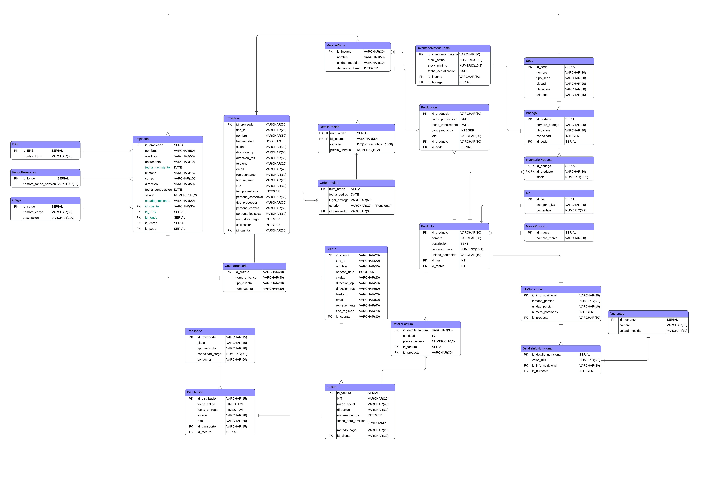

# **Proyecto Final: Sistema de Gestión Empresarial (SGE) - Bases de Datos**

**Asignatura:** 750006C Bases de Datos

**Institución:** Universidad del Valle - Escuela de Ingeniería de Sistemas y Computación

**Docente:** Susana Medina Gordillo

**Semestre:** 2026-1

#### **🏢 Información de la Empresa Seleccionada**

**Nombre de la Empresa:** Alpina Productos Alimenticios S.A.S. BIC.

**Sector Económico:** Manufactura / Industria Alimentaria

**Descripción breve:** Alpina es una empresa multinacional colombiana productora de alimentos a base de lácteos. Fue fundada por los suizos Max Bänziger y Walter Göggel en Sopó, Cundinamarca. Inicialmente, la empresa se enfocó en elaborar quesos y mantequillas artesanales pero con el paso del tiempo amplió sus productos a yogures, bebidas lácteas, postres, avenas, jugos y alimentos funcionales.

Actualmente, Alpina cuenta con presencia en diferentes regiones de Colombia y otros países de Latinoamérica, manejando procesos de abastecimiento, producción, almacenamiento, distribución y comercialización de productos alimenticios a gran escala.

#### **👥 Integrantes del Grupo**

Nicol Vanessa Serna Gómez - 2537866

Sergio Ernesto Patiño Rodriguez - 2440051

Paula Mariana Murillo Huertas - 2436488

#### **🛠️ Stack Tecnológico**

**Lenguaje:** Python 3.10+

**Framework Web:** Django

**Base de Datos:** PostgreSQL (Local para desarrollo / Amazon RDS para producción)

**ORM / Conector:** Django ORM

#### 📐 Diseño de la Base de Datos (Avance #1)

**Diagrama Entidad-Relación (DER)**

**Diccionario de Datos Resumido**

**Terceros:** Gestión de clientes y proveedores (RUT, NIT, Habeas Data).

**Productos/Insumos:** Control de stock, demanda diaria y tiempos de entrega.

**Facturacion:** Registro de ventas con cálculo de IVA legal colombiano.

**Ordenes de Pedido:** Gestión de compras y reabastecimiento

#### **🚀 Guía de Instalación y Ejecución**

**1. Clonar el repositorio**

git clone https://github.com/YraM-27/SGE-Alpina-Univalle

cd SGE-Alpina-Univalle

**2. Configurar entorno virtual**

python -m venv venv

source venv/bin/activate  # En Windows: venv\\Scripts\\activate

pip install -r requirements.txt

**3. Configurar Base de Datos**

Crear una base de datos en PostgreSQL llamada sge\_univalle.

Ejecutar los scripts en la carpeta db/ en el siguiente orden:

DDL\_tablas.sql

views\_triggers.sql

DML\_datos\_prueba.sql

**4. Ejecutar Aplicación**

\# Para Django

python manage.py runserver

#### **📄 Notas de Entrega y Funcionalidades**

**Gestión de Stock:** La aplicación calcula automáticamente el estado (Crítico/Alerta/Seguro) mediante una Vista en la base de datos.

**Integridad:** Se han implementado restricciones de llave foránea para impedir la eliminación de proveedores con pedidos activos.

**IVA:** El sistema soporta las tarifas del 19%, 5%, 0% y Excluidos.

